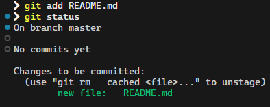
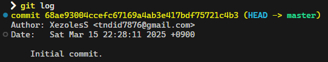
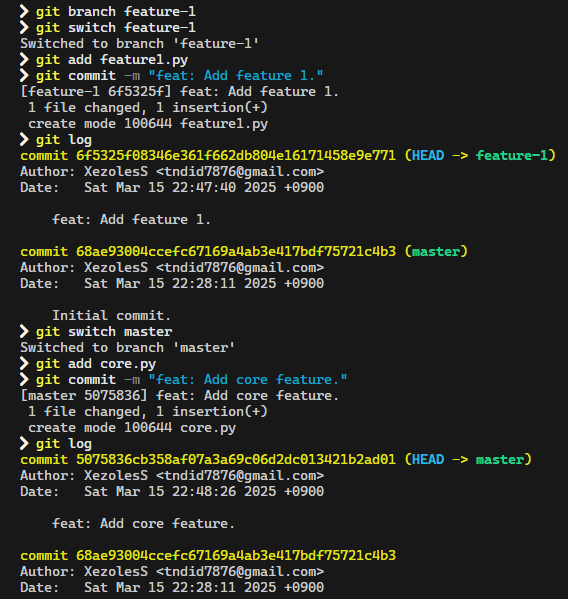
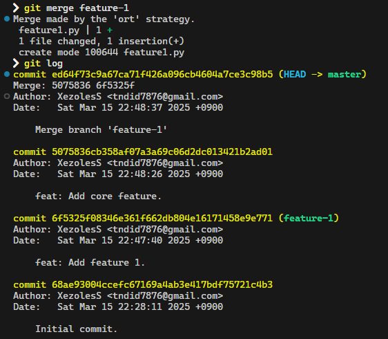

# Introduction
### What is Git?
- Git is a **distributed version control system** that tracks changes in source code during software development.
- It allows multiple developers to work on the same project without overwriting each other's work.
- Key concepts: repositories, commits, branches, merges.

### What is GitHub?
- GitHub is a cloud-based platform that hosts Git repositories.
- It provides a user-friendly interface for managing Git repositories, collaborating with others, and reviewing code.
- Key features: pull requests, issues, code reviews, project boards.

### Difference Between Git and GitHub
- Git is the tool for version control (local).
- GitHub is a service that hosts Git repositories (remote).

### Why Use Git and GitHub?
- **Collaboration**: Multiple people can work on the same project.
- **Version Control**: Track changes and revert to previous versions if needed.
- **Backup**: Code is stored remotely on GitHub.
- **Code Review**: Use pull requests to review and discuss changes.
- **Documentation**: Use issues and project boards to manage tasks.


# Git Basics
### 1. Initializing
Creating a new Git repository:
```bash
git init
```


Clone an existing repository:
```bash
git clone <repository-url>
```

### 2. Checking Status
```bash
git status
```


### 3. Staging
```bash
git add <file-name>
```


Add all changed files:
```bash
git add .
```

### 4. Unstaging
```bash
git rm --cached <file-name>
```

### 5. Commit
```bash
git commit -m "Commit Message."
```


### 6. Viewing History
```bash
git log
```


### 7. Branching
Create a new branch:
```bash
git branch <branch-name>
``` 

Switch to a branch:
```bash
git switch <branch-name>
```
or
```bash
git checkout <branch-name>
```


### 8. Merging
```bash
git merge <branch-name>
```



### 9. Rebasing
```bash
git rebase <branch-name>
```


### 10. Remote
Fetch changes:
```bash
git fetch
```

Pull changes:
```bash
git pull <remote> <branch>
```

Push changes:
```bash
git push <remote> <branch>
```

### .gitignore
`.gitignore` is a **plain text file** that tells Git which files or directories to ignore in a project.  
It prevents files like logs, dependencies, or local configuration files from being tracked by Git.


# GitHub Basics
### Pull Requests
Create a pull request to propose changes and request a code review.
* Steps:
  - Push your branch to GitHub.
  - Go to the repository on GitHub and click "New Pull Request."
  - Select the branches to compare and add a description.

### Issues
Use issues to track bugs, enhancements, or tasks.  
Assign issues to team members and link them to pull requests.

### Project Boards
Organize tasks using Kanban-style boards.  
Create columns like "To Do," "In Progress," and "Done."

### Code Reviews
Review pull requests by commenting on specific lines of code.  
Approve or request changes before merging.

### Forking and Cloning
Fork a repository to create your own copy.  
Clone a repository to work on it locally.


# Setting Up
### 1. Install Git
- Download and install Git from git-scm.com.
- Verify installation: Run git --version in the terminal.

### 2. Create a GitHub Account
Sign up at github.com.

### 3. Configure Git
Set your username and email:
```bash
git config --global user.name "Your Name"
git config --global user.email "your.email@example.com"
```
