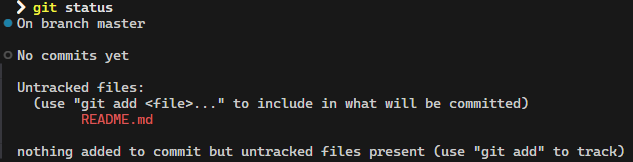

# Introduction
### What is Git?
- Git은 **분산 버전 관리 시스템(Distributed Version Control System)**으로, 소프트웨어 개발 중 소스코드의 변경사항을 추적하는 기능을 제공한다.
- 여러 개발자가 같은 프로젝트에서 서로의 작업을 덮어쓰지 않도록 하는 기능을 제공한다.
- 주요 개념: 리포지토리(Repository), 커밋(Commit), 브랜치(Branch), 머지(Merge)

### What is GitHub?
- GitHub는 클라우드 기반 플랫폼으로, Git의 리포지토리를 호스팅한다.
- Git의 리포지토리를 저장하는 기능에 더해, 협업, 리뷰 등의 다양한 기능을 GUI로 제공한다.
- 주요 개념: 풀 리퀘스트(Pull Request), 이슈(Issue), 코드 리뷰(Code Review)

### Git과 GitHub의 차이점
- Git은 버전 관리를 위한 도구이다. (local).
- GitHub은 Git의 리포지토리를 저장하여 호스팅해주는 서비스이다. (remote).

### 용어 정리
- **리포지토리(Repository)**: Git의 작업 폴더를 말한다. `git init`으로 생성할 수 있으며, `.git`이라는 폴더의 상위 폴더가 리포지토리가 된다. 줄여서 리포(Repo)라고 부른다.
- **커밋(Commit)**: 코드의 변경사항이 적용된 하나의 로그를 말한다.
- **브랜치(Branch)**: 어떠한 커밋을 기준으로하여 변경사항을 따로 기록할 수 있는 하나의 작업 공간이다. 프로젝트의 주가 되는 브랜치를 master 브랜치, 또는 main 브랜치라고 부른다. 주로 master 브랜치에 영향을 미치지 않고 기능을 개발하기 위해 branch를 새로 생성하여 기능을 개발하고, 기능이 완성되면 프로젝트 관리자가 master 브랜치에 머지하는 작업을 한다.
- **머지(Merge)**: 어떤 브랜치를 다른 브랜치와 합치는 기능이다. 
- **컨플릭트(Conflict)**: 브랜치를 머지할 때 발생할 수 있는 코드의 충돌이다. 머지할 두 브랜치가 같은 파일에서 서로 다른 작업을 할 경우 발생하며, 이 때는 프로젝트 관리자가 리뷰를 통해 작성자에게 컨플릭트를 해결해달라고 요청하거나, 직접 해결해야 한다. Git이 기본적으로 컨플릭트가 난 부분을 알려준다.
- **풀 리퀘스트(Pull Request)**: 보통 PR이라고 줄여 부르며, GitHub에서 한 브랜치를 다른 브랜치에 머지해달라고 요청하는 기능을 말한다. PR을 올리면 GitHub가 해당 브랜치가 머지할 브랜치와 비교하여 변경된 부분, 컨플릭트가 난 부분 등을 보기 쉽게 제공해주어 프로젝트 관리자가 리뷰를 간편하게 할 수 있게 한다. 물론 반려(Close)도 할 수 있다.
_ **이슈(Issue)**: GitHub의 프로젝트에서, 기능 추가를 요청하거나, 버그를 제보하는 등의 모든 프로젝트 관련 요청들을 올릴 수 있는 기능을 말한다. 이 경우는 프로젝트 관리자가 직접 이슈를 보고 코드를 작성하거나, 다른 프로그래머가 이슈를 해결하여 PR을 올려 해결한다. 물론 이슈를 올린 유저가 단순히 트래킹을 위해서 이슈를 올리고, PR을 직접 올리는 경우도 있다.
- **코드 리뷰(Code Review)**: 프로젝트 관리자가 PR을 보고 변경사항들이 제대로 동작하는지 확인하는 작업을 말한다.


### 왜 Git과 GitHub을 사용하나요?
- **협업**: 여러 인원이 하나의 프로젝트에 유동적으로 참여할 수 있다.
- **버전 관리**: 변경사항을 추적할 수 있고 필요한 경우 이전 버전으로 되돌아 갈 수 있다.
- **백업**: GitHub에 코드가 따로 저장된다.
- **코드 리뷰**: PR을 통해 코드를 리뷰하고, 변경점에 대한 토론을 할 수 있다.
- **문서화**: 이슈와 다른 기능들을 이용하여 코드를 문서화할 수 있다.


# Git 기초
### 1. Initializing
Git 리포지토리를 만들기:
```bash
git init
```


Git 서버에서 리포지토리를 복사하기:
```bash
git clone <repository-url>
```

### 2. Checking Status
현재 Git 리포지토리 상태를 확인하기:
```bash
git status
```


### 3. Staging
변경사항을 스테이징 하기:
```bash
git add <file-name>
```


모든 변경된 파일을 스테이징 하기:
```bash
git add .
```

#### 스테이징(Staging)이란?
커밋을 하고 싶은 파일들을 추가하는 기능이다. 스테이징을 하면 파일의 변경사항이 전부 커밋할 리스트에 추가되고, 파일을 수정하면 다시 스테이징을 해주어야 한다.


### 4. Unstaging
스테이징 된 파일을 스테이지 리스트에서 제거하기:
```bash
git rm --cached <file-name>
```

### 5. Commit
커밋하기:
```bash
git commit -m "Commit Message."
```


### 6. Viewing History
Git 히스토리 보기:
```bash
git log
```


### 7. Branching
새 브랜치 작성하기:
```bash
git branch <branch-name>
``` 

현재 작업 중인 브랜치를 변경하기:
```bash
git switch <branch-name>
```
or
```bash
git checkout <branch-name>
```


#### `git checkout`의 범용성에 대해  
`git checkout`은 낡은 명령어로, 하나의 명령어가 다수의 기능을 포함하고 있다. 브랜치 전환, 파일 체크아웃, 커밋으로 돌아가는 등의 기능을 한다.  
그래서 Git 2.23.0 버전부터, 해당 명령어의 기능을 명확히 하기 위하여 `git switch`, `git restore` 명령어가 추가됐다. `git switch`는 브랜치 전환에 집중한 명령어고, `git restore`는 브랜치나 커밋에서 파일을 복구하는 기능에 집중한 명령어다.  
아직도 명령어가 남아 있는 이유는 Git은 backward compatibility를 중시하여 기존 명령어들을 최대한 deprecate 시키지 않아서 그렇다.  
따라서, 브랜치 전환에 `git checkout` 명령어를 사용하여도 무방하다.

### 8. Merging
머지하기:
```bash
git merge <branch-name>
```
  
  
*현재 작업중 브랜치에 `<branch-name>` 브랜치를 머지한다는 뜻이다*
*위 예시에서는 `feature-1` 브랜치를 `master` 브랜치에 머지했다*

### 9. Rebasing
리베이싱 하기:
```bash
git rebase <branch-name>
```

#### 리베이스(Rebase)란?
브랜치를 한 브랜치로 합치는 기능이란 점은 머지와 동일하나, 방법이 다르다  
머지는 두 브랜치의 최종 결과만을 합쳐서 새로운 커밋을 만들고, 리베이스는 두 브랜치 중 하나를 기준으로 잡아, 그 위에 다른 브랜치의 커밋들을 전부 옮기는 방법이다.  
단, 그대로 옮기는 것이 아니라 변경사항이 같은 **새로운 커밋들을 만드는 방식**이라, 커밋 해시(커밋의 고유 ID 같은 개념)가 달라져 리베이스를 잘못하는 경우 다른 브랜치에 영향을 끼치는 경우가 있으니 주의해야한다!

### 10. Remote
변경점 불러오기:
```bash
git fetch
```

변경점을 로컬에 저장하기:
```bash
git pull <remote> <branch>
```

변경점을 서버에 저장하기:
```bash
git push <remote> <branch>
```

#### fetch와 pull의 차이점?
`git fetch`는 변경점이 있는지만 불러오고 실제 파일을 변경하지는 않는다.  
`git pull`은 변경점을 전부 로컬의 파일에 적용하여 파일을 수정한다.

### .gitignore
`.gitignore`는 **텍스트 파일**로 Git이 어떤 파일이나 폴더의 수정사항을 무시해야 하는지 기록해 둔 파일이다.  
프로젝트 중 생성되는 바이너리 파일, 로그, 의존성이나 개인 개발 환경설정 파일 등의 추적을 무시하고 싶을 때 사용한다.


# GitHub 기초
### Pull Requests
PR을 올려 변경점을 제시하고, 프로젝트 관리자가 리뷰할 수 있게 한다.
* Steps:
  - GitHub에 브랜치를 푸시한다. (또는, 포크하여 수정하고 푸시한다.)
  - GitHub 리포지토리에서 Pull Request 탭의 "New Pull Request." 버튼을 클릭한다.
  - PR을 올릴 브랜치를 선택하고 설명을 작성한다.

### Issues
버그를 제보하거나, 기능을 제안하는 등 프로젝트의 개선을 요구하고 싶을 때 사용한다.
이슈는 프로젝트의 멤버들이 해당 이슈 해결을 위해 담당할 수 있으며, 이슈의 번호를 PR의 설명에 기재하여 해당 이슈를 해결한 PR을 올릴 수 있다.

### Project Boards
프로젝트의 작업들을 칸반보드 식으로 정리할 수 있다.
"To Do," "In Progress," "Done"과 같은 행을 만들어 어떤 작업들을 해야하는지, 진행 중인지, 완료됐는지 간단하게 볼 수 있다.

### Code Reviews
코드의 특정한 줄에 코멘트를 남겨 PR을 리뷰할 수 있다.
PR을 머지하기 전에 변경을 요구하거나, 승인해야한다.

### Forking and Cloning
포크(Fork)는 어떤 GitHub 리포지토리를 복사하여 자신의 계정에 새로운 GitHub 리포지토리를 만드는 것이다.
클론(Clone)은 어떤 GitHub 리포지토리를 복사하여 자신의 로컬환경에 리포지토리를 만드는 것이다.


# Setting Up
### 1. Git 설치하기
- [git-scm.com](git-scm.com)에서 Git을 다운로드 한다.
- 설치 확인 방법: 터미널에서 `git --version` 명령어를 실행한다.

### 2. GitHub 계정 만들기
[GitHub](github.com) 홈페이지에서 계정을 만든다.

### 3. Git 설정하기
Git에 자신의 정보를 기재한다:
```bash
git config --global user.name "사용자-이름"
git config --global user.email "사용자-이메일@example.com"
```
이런 정보를 기재하는 이유는 커밋을 누가 했는지 확인하기 위함이다.  
누가 무엇을 했는지는 `git blame` 명령어로 확인할 수 있다.

